All code just needs to be run in the jupyter environment. You need standard libraries like seaborn, scipy, pandas, and np installed.


```python
%matplotlib inline
import numpy as np
import pandas as pd
import scipy as sp
import scipy.io
import matplotlib.pyplot as plt
from matplotlib.pyplot import gca
from matplotlib import cm, mlab
from mpl_toolkits.mplot3d import Axes3D
from IPython.display import Image
```

# 1

## a


```python
Image(filename="1a.png")
```


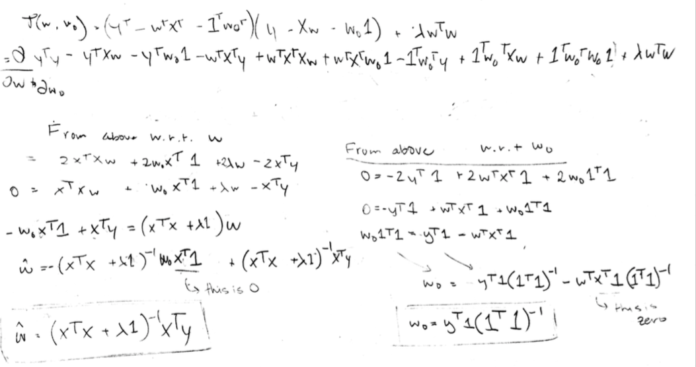


**Notes**
we know that $X^T1$ is 0 because the mean is 0.

## b


```python
housing_data = scipy.io.loadmat("data/housing_data.mat")
raw_x_train = pd.DataFrame(housing_data['Xtrain'])
raw_y_train = pd.DataFrame(housing_data['Ytrain'])
raw_x_validate = pd.DataFrame(housing_data['Xvalidate'])
raw_y_validate = pd.DataFrame(housing_data['Yvalidate'])
print(raw_x_train.shape, raw_y_train.shape)
print( raw_x_validate.shape,raw_y_validate.shape)
```

    (19440, 8) (19440, 1)
    (1200, 8) (1200, 1)


```python
# raw_x_train[9] = 1 # bias term or normalize :)
# raw_x_validate[9] = 1
# from sklearn import preprocessing
# scaler = preprocessing.StandardScaler(with_std=False).fit(X_train)
# print(scaler)
# X_train = scaler.transform(raw_x_train.values)
# X_val = scaler.transform(raw_x_validate.values)
means = raw_x_train.values.mean(axis=0)

X_train = raw_x_train.values - np.array([means for x in range(len(raw_x_train.values))])
y_train = raw_y_train.values


X_val = raw_x_validate.values - np.array([means for x in range(len(raw_x_validate.values))])
y_val = raw_y_validate.values

print(X_train.shape, y_train.shape)
print(X_val.shape, y_val.shape)
```

    (19440, 8) (19440, 1)
    (1200, 8) (1200, 1)


```python
def kfolds(X, y, n_folds):
    chunk_size = len(X)/n_folds
    chunks = [(chunk_size * x, chunk_size * (x+1)) for x in range(n_folds)]
    for start, end in chunks:
        sub_X = np.concatenate([X[:start], X[end:]])
        sub_y = np.concatenate([y[:start], y[end:]])
        other_X = X[start:end]
        other_y = y[start:end]
        yield sub_X, sub_y, other_X, other_y
        
def get_results(y_hat, y_val):
    rss = np.sum((y_val - y_hat) ** 2)
    tss = np.sum((y_val - np.mean(y_val)) ** 2)
    r_sqrd = 1 - (rss/tss)
    return rss, r_sqrd

def train_model(X, y, lamb):
    lamby = lamb * np.ones(len(X.T))
    front = np.dot(X.T, X)
    invert_me = front + lamby
    inv = np.linalg.inv(invert_me)
    return inv.dot(np.dot(X.T, y))

# w = np.dot(np.dot(np.linalg.inv(np.dot(X_train.T, X_train)), X_train.T), y_train)
# print(w.reshape((9,)))
# y_hat = np.dot(X_val,w)
```


```python
all_scores = {}
for lamb in [10, 10e-1, 10e-2, 10e-3, 10e-4, 10e-5, 10e-6, 10e-7, 10e-8]:
    print("Lambda Value: ", lamb)
    scores = []
    for count, (X_1, y_1, X_2, y_2) in enumerate(kfolds(X_train, y_train, 10)):
        w = train_model(X_1, y_1, lamb)
        y_hat = np.dot(X_2, w)
        rss, r_sqrd = get_results(y_hat, y_2)
        scores.append(rss)
    print("Mean RSS of: %.2f and variance of %.2f" % (np.array(scores).mean(), np.array(scores).var()))
    all_scores[lamb] = scores
```

    Lambda Value:  10
    Mean RSS of: 92710448243753.16 and variance of 2032134469965135992586240.00
    Lambda Value:  1.0
    Mean RSS of: 92710539639546.80 and variance of 2029584036405399779278848.00
    Lambda Value:  0.1
    Mean RSS of: 92710549864972.42 and variance of 2029327750219693341802496.00
    Lambda Value:  0.01
    Mean RSS of: 92710550898494.22 and variance of 2029302109118090216210432.00
    Lambda Value:  0.001
    Mean RSS of: 92710551001956.33 and variance of 2029299544883034509541376.00
    Lambda Value:  0.0001
    Mean RSS of: 92710551012303.61 and variance of 2029299288458291344048128.00
    Lambda Value:  1e-05
    Mean RSS of: 92710551013338.38 and variance of 2029299262815797109587968.00
    Lambda Value:  1e-06
    Mean RSS of: 92710551013441.84 and variance of 2029299260251535472328704.00
    Lambda Value:  1e-07
    Mean RSS of: 92710551013452.19 and variance of 2029299259995115187339264.00


    /Library/Frameworks/Python.framework/Versions/3.5/lib/python3.5/site-packages/ipykernel/__main__.py:5: DeprecationWarning: using a non-integer number instead of an integer will result in an error in the future
    /Library/Frameworks/Python.framework/Versions/3.5/lib/python3.5/site-packages/ipykernel/__main__.py:6: DeprecationWarning: using a non-integer number instead of an integer will result in an error in the future
    /Library/Frameworks/Python.framework/Versions/3.5/lib/python3.5/site-packages/ipykernel/__main__.py:7: DeprecationWarning: using a non-integer number instead of an integer will result in an error in the future
    /Library/Frameworks/Python.framework/Versions/3.5/lib/python3.5/site-packages/ipykernel/__main__.py:8: DeprecationWarning: using a non-integer number instead of an integer will result in an error in the future


```python
pd.DataFrame(all_scores).mean(axis=0)
```


    1.000000e-07    9.271055e+13
    1.000000e-06    9.271055e+13
    1.000000e-05    9.271055e+13
    1.000000e-04    9.271055e+13
    1.000000e-03    9.271055e+13
    1.000000e-02    9.271055e+13
    1.000000e-01    9.271055e+13
    1.000000e+00    9.271054e+13
    1.000000e+01    9.271045e+13
    dtype: float64


```python
best_lambda = pd.DataFrame(all_scores).mean(axis=0).idxmin()
print(best_lambda)
print("Best Lambda Value:", best_lambda)
```

    10.0
    Best Lambda Value: 10.0


```python
pd.DataFrame(all_scores).min(axis=0)
```


    1.000000e-07    8.989462e+13
    1.000000e-06    8.989462e+13
    1.000000e-05    8.989462e+13
    1.000000e-04    8.989462e+13
    1.000000e-03    8.989462e+13
    1.000000e-02    8.989462e+13
    1.000000e-01    8.989460e+13
    1.000000e+00    8.989446e+13
    1.000000e+01    8.989300e+13
    dtype: float64


```python
pd.DataFrame(all_scores).min(axis=0).plot(kind='bar')
```


    <matplotlib.axes._subplots.AxesSubplot at 0x107909390>


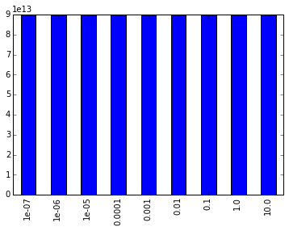


```python
ws = train_model(X_train, y_train, best_lambda)
y_hat = np.dot(X_val, ws)
pd.DataFrame(ws[:8]).plot() # removed bias
rss = np.sum((y_val - y_hat) ** 2)
tss = np.sum((y_val - np.mean(y_val)) ** 2)
r_sqrd = 1 - (rss/tss)
print("Best Lambda Value:", best_lambda)
import locale
locale.setlocale(locale.LC_ALL, 'en_US')
old = locale.format("%i", 5794953797676, grouping=True)
new = locale.format("%i", rss, grouping=True)
diff = locale.format("%i", rss - 5794953797676, grouping=True)
print("RSS: %s. Old RSS: %s, difference: %s" % (new, old, diff))
print("Range of y Hat Values => Min: %i Max: %i" %(min(y_hat), max(y_hat)))
print("Range of True Y Values => Min: %i Max: %i" %(min(y_val), max(y_val)))
print("R^2: %.3f" % r_sqrd)
```

    Best Lambda Value: 10.0
    RSS: 55,472,726,037,902. Old RSS: 5,794,953,797,676, difference: 49,677,772,240,226
    Range of y Hat Values => Min: -263237 Max: 504108
    Range of True Y Values => Min: 28300 Max: 500001
    R^2: -2.417


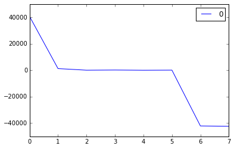


## HW3 Plot
We can see that they're roughly the same except for the fact that the newer graph is just a but more squished in - which is what we would expect from using shrinkage.


```python
Image(filename='hw3_plot.png') 
```


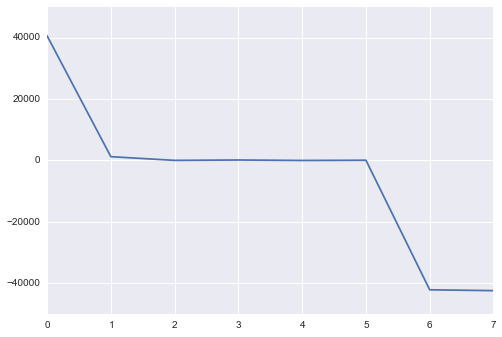


error terms for hw3.

# 2

## 2.a 

$$1/36$$


## 2.b

$$ p  + (1 - p) = 1 $$
$$ p^* = 1 - (1 - p)^3 $$
$$ p^* = 1 - (35/36)^3 $$
$$ p^* = .081039952 $$

## 2.c

I've figured out it's one of two things (I've heard difference answers from the GSIs as to their correctness).

It is either 203/1000.

OR

Here's what we need to calculate.

$$ P(x \leq 203) = (1000 choose 203) 0.5 ^{203} (1-0.5)^{1000-203} $$

However this is obviously inefficient computationally, so we've got to approximate the binomial with the normal distribution with the continuity correction.


```python
n = 1000
p = 0.5
mu = n * p
sigma = np.sqrt(1000 * 0.5 * (1-0.5))
z = (203.5 - mu)/sigma
print(z)
```

    -18.7523065248


The $ p < 0.00001 $ making it a simple matter to reject the null hypothesis[that there is no difference between the errors of our algorithm and our competitors].


## 2.d 
With more trials, we are more likely to get a 0.05 p-value or lower. Therefore we cannot reject the null hypothesis without adjusting our critical value accordingly.

## 2.e
Just like with our dice roll above, with repeated trails we are changing the probabilities. We're effectively rolling the dice several times and we've got to correct for that.

$$ p_{significant} + p_{not-significant} = 1$$

$$p_s = 1 - (1 - p_s)^m$$

Just like above, as $m$ increases $(1-p_s)$ will approach 0 and $p_s$ will approach 1. We can correct for this by  multiplying our returned p-value by m trials. As m increases to infinity, this will cause p_s to now approach zero, eliminating any possible chance of false discovery rate (and consequentially positive rates). That is to say, the Bonferroni correction prevents false positives, but doesn't prevent false negatives. This is why it's often called too conservative.

We can get this from the binomial expansion as well, the Bonferroni Correction allows you to "grab" the first and most significant step in the binomial expansion and scale according to that. It's not a "perfect correction" but it's a good one.


## 2.f

Although we get a small value, due to the Bonferroni Correction, this gene is not significant because we get a p-value of 5. A p-value of 5 shows us that the Bonferroni correction acts as an upper bound on our probability. Because the corrected p value is so high, we cannot reject the null hypothesis.

# 3


```python
Image("3.png")
```


## 3.c (part 2)

These questions are relevant because they show us that even if things can be pairwise independent, they may not be mutually independent or they may have some hidden dependencies between one another. Commonly known as the XOR problem, where the data is not independent and linearly seperable because they are mutually dependent.

A data set that would reflect this would be where a companies best customers are either young and male or old and female, but not both. This dataset is not linearly separable in the conventional space by a method like a perceptron. However this might be linearly seperable in some phi-space, which is why we might approach this kind of problem with a kernel.

# 4

## 4.a


```python
delta = 0.025
x = np.arange(-4.0, 7.0, delta)
y = np.arange(-4.0, 5.0, delta)
X, Y = np.meshgrid(x, y)
Z = mlab.bivariate_normal(X, Y, sigmax=2, sigmay=1.0, mux=1, muy=1, sigmaxy=0.0)
fig = plt.figure()
ax = fig.gca(projection='3d')
CS = plt.contour(X, Y, Z)
plt.show()
fig = plt.figure()
CS = plt.contour(X, Y, Z)
plt.show()
```


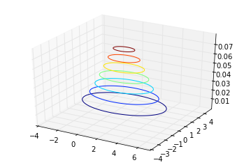


## 4.b


```python
delta = 0.025
x = np.arange(-10.0, 7.0, delta)
y = np.arange(-4.0, 8.0, delta)
X, Y = np.meshgrid(x, y)
Z = mlab.bivariate_normal(X, Y, sigmax=3, sigmay=2.0, mux=-1, muy=2, sigmaxy=1.0)
fig = plt.figure()
ax = fig.gca(projection='3d')
CS = plt.contour(X, Y, Z)
plt.show()
fig = plt.figure()
CS = plt.contour(X, Y, Z)
plt.show()
```


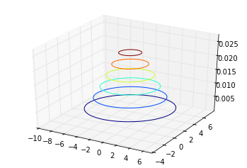


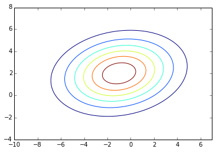


## 4.c


```python
delta = 0.025
x = np.arange(-10.0, 7.0, delta)
y = np.arange(-10.0, 10.0, delta)
X, Y = np.meshgrid(x, y)
Z1 = mlab.bivariate_normal(X, Y, sigmax=1, sigmay=2.0, mux=0, muy=2, sigmaxy=1.0)
Z2 = mlab.bivariate_normal(X, Y, sigmax=1, sigmay=2.0, mux=2, muy=0, sigmaxy=1.0)
Z = Z1 - Z2
fig = plt.figure()
ax = fig.gca(projection='3d')
CS = plt.contour(X, Y, Z)
plt.show()
fig = plt.figure()
CS = plt.contour(X, Y, Z)
plt.show()
```


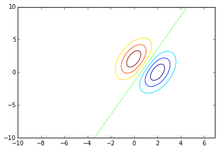


## 4.d


```python
delta = 0.025
x = np.arange(-5.0, 7.0, delta)
y = np.arange(-5.0, 10.0, delta)
X, Y = np.meshgrid(x, y)
Z1 = mlab.bivariate_normal(X, Y, sigmax=1, sigmay=2.0, mux=0, muy=2, sigmaxy=1.0)
Z2 = mlab.bivariate_normal(X, Y, sigmax=3, sigmay=2.0, mux=2, muy=0, sigmaxy=1.0)
Z = Z1 - Z2
fig = plt.figure()
ax = fig.gca(projection='3d')
CS = plt.contour(X, Y, Z)
plt.show()
fig = plt.figure()
CS = plt.contour(X, Y, Z)
plt.show()
```


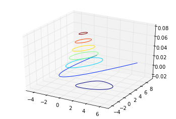


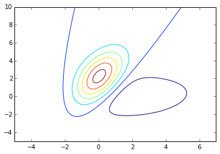


## 4.e


```python
delta = 0.025
x = np.arange(-5.0, 7.0, delta)
y = np.arange(-5.0, 10.0, delta)
X, Y = np.meshgrid(x, y)
Z1 = mlab.bivariate_normal(X, Y, sigmax=1, sigmay=2.0, mux=1, muy=1, sigmaxy=0.0)
Z2 = mlab.bivariate_normal(X, Y, sigmax=2, sigmay=2.0, mux=-1, muy=-1, sigmaxy=1.0)
Z = Z1 - Z2
fig = plt.figure()
ax = fig.gca(projection='3d')
CS = plt.contour(X, Y, Z)
plt.show()
fig = plt.figure()
CS = plt.contour(X, Y, Z)
plt.show()
```


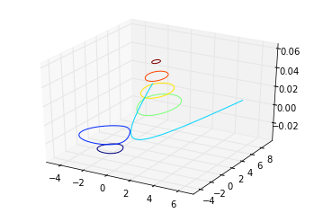


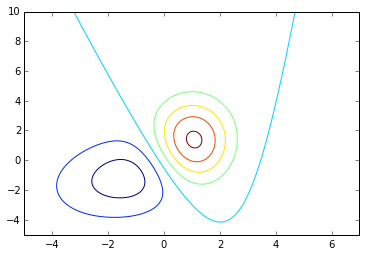


# 5

## 5.a


```python
N = 100
np.random.seed(20)
x1s = np.random.normal(3,np.sqrt(9), 100)
x2s = 1/2*x1s + np.random.normal(4, np.sqrt(4), 100)

print("Mean X_1:", np.mean(x1s))
print("Mean X_2:", np.mean(x2s))
df = pd.DataFrame({"x1": x1s, "x2": x2s})
```

    Mean X_1: 2.83641903357
    Mean X_2: 5.59159600373


## 5.b


```python
df.cov()
```


<div>
<table border="1" class="dataframe">
  <thead>
    <tr style="text-align: right;">
      <th></th>
      <th>x1</th>
      <th>x2</th>
    </tr>
  </thead>
  <tbody>
    <tr>
      <th>x1</th>
      <td>10.457903</td>
      <td>4.695986</td>
    </tr>
    <tr>
      <th>x2</th>
      <td>4.695986</td>
      <td>6.122321</td>
    </tr>
  </tbody>
</table>
</div>


## 5.c


```python
eig_vals, eig_vecs = np.linalg.eig(df.cov().values) # quiver functions to get arrows
print(eig_vecs)
print(eig_vals)
```

    [[ 0.84235502 -0.53892302]
     [ 0.53892302  0.84235502]]
    [ 13.46230681   3.11791667]


## 5.d


```python
hw = 15
df.plot(x="x1", y='x2', kind='scatter', ylim=(-hw,hw),xlim=(-hw,hw))
x, y = df.x1.mean(), df.x2.mean()
u1, v1 = eig_vecs[:,0] * eig_vals[0]
u2, v2 = eig_vecs[:,1] * eig_vals[1]
plt.quiver(x, y, u1, v1, angles='xy', scale_units='xy',scale=1,color='r')
plt.quiver(x, y, u2, v2, angles='xy', scale_units='xy',scale=1,color='g')
```


    <matplotlib.quiver.Quiver at 0x10b463eb8>


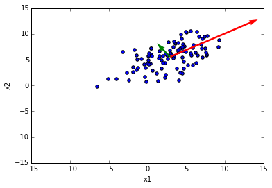


## 5.e


```python
U = eig_vecs
x1_prep = x1s - np.mean(x1s)
x2_prep = x2s - np.mean(x2s)
points = [U.T.dot(x) for x in zip(x1_prep, x2_prep)]
pd.DataFrame(np.array(points)).plot(x=0, y=1, kind='scatter', ylim=(-hw,hw),xlim=(-hw,hw))
```


    <matplotlib.axes._subplots.AxesSubplot at 0x107d99780>


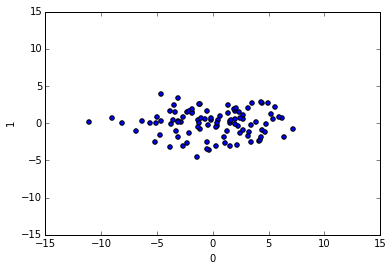


# 6 

## 6.a

$ \Sigma^{-1} $ will not exist when our columns are linearly dependent on one another or when they contain duplicate information. All eigenvalues must be positive as well.

A transformation we can apply is to remove the duplicate columns/hyper correlated features and more generally duplicate information. All diagonal values must be non-zero. (Gaussian Elimination).

## 6.b

$$ x^T \Sigma^{-1} x = ||Ax||^2_2 $$

$$  x^T \Sigma^{-1} x = x^TA^TAx $$

$$ \Sigma^{-1} = A^TA $$

$$(U S^{2} U^T)^{-1} = A^TA $$

$ S = $ singular values 

$$U S^{-1} S^{-1} U^T = A^TA $$

$$ S^{-1} U^T = A $$

## 6.c

By doing this conversion we're revealing that we're really just measuring a kind of distance from the mean with our probability. We're converting probability into a distance by looking at the distance measures along the eigenvector axes. Fundamentally the covariance is a measurement from the mean.

## 6.d

$C = ||Ax||^2_2 $. To get the minimum value of C, since we’ve decomposed this we know that basically A will represent S^-1 and U^T.  Those two together make the diagonal covariance matrix combined with the column eigenvectors. Since we have this x constraint we’re basically doing this dot product diagonal covariance matrix + eigenvectors and some vector x. To maximize or minimize C, we create a x as a vector of $[0,..,..1]$ where the 1 is at the location of greatest variance or 1 is at the location of least variance respectively.

Intuitively we will have maximum or minimum of the direction and power of covariance. This has the effect of selecting the dimension with the most (or least) variance, since there are only diagonal values in the matrix.

The Maximum value of $||Ax_2^2||$ would be the smallest probability while minimum is the one with the highest probability of belonging to the class. Because we've got this distance measure now, we're intuitively trying to get an $x$ value that would minimize the distance measure $||Ax||^2_2$ (while constrained by $||x||_2$). Doing this would maximize the probability of f(x).

# 7


```python
from scipy.stats import multivariate_normal

dig_train = scipy.io.loadmat("data/train.mat")
dig_X = dig_train['train_images'].T.reshape((60000,784))
dig_y = dig_train['train_labels'].reshape(60000,)
shuff = np.arange(len(dig_y))
np.random.shuffle(shuff)
dig_X_train = dig_X[shuff]/255
dig_y_train = dig_y[shuff]
dig_val_X = dig_X_train[50000:]
dig_val_y = dig_y_train[50000:]
dig_X_train = dig_X_train[:50000]
dig_y_train = dig_y_train[:50000]


dig_test = scipy.io.loadmat("data/test.mat")
dig_X_test = dig_test['test_images']
dig_y_test = dig_test['test_labels'].reshape((10000))

print(dig_X_train.shape,dig_y_train.shape, dig_X_test.shape, dig_y_test.shape) # make sure our shapes are good
```

    (50000, 784) (50000,) (10000, 784) (10000,)


## 7.a

The maximum likelihood estimates for the mean and the covariance matrix of a Gaussian


```python
Image("7a.png")
```


```python
Image("7a2.png")
```


## 7.b

You can compute priors by seeing the density of a given value in the training set.


```python
priors = pd.Series(dig_y_train).value_counts() / len(dig_y_train)
priors
```


    1    0.11236
    7    0.10452
    3    0.10182
    9    0.09928
    2    0.09902
    8    0.09884
    0    0.09866
    6    0.09848
    4    0.09702
    5    0.09000
    dtype: float64


```python
means = {}
for num in range(10):
    means[num] = dig_X_train[dig_y_train == num].mean(axis=0)
```

## 7.c


```python
import seaborn as sns
```


```python
sns.heatmap(np.cov(dig_X_train[dig_y_train == 1].T))
```


    <matplotlib.axes._subplots.AxesSubplot at 0x10aa73ba8>


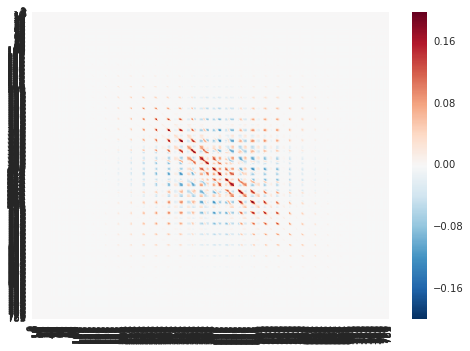


These visualizations show how the various pixels covary with one another. I've chosen to visualize a 1. In this image we can see clearly that the image has been padded, because there seems to be a frame around the entire covariance. Additionally we can see that there seems to be little covariance in the center, this is because for a one, everyone draws a line through the center however we see variance around that because sometimes the ones arc left or arc right.

## 7.d

### i


```python
def get_mu_sigma(X_, y_, labels, alpha):
    mus = []
    for label in labels:
        vals = X_[y_ == label]
        mus.append(np.mean(vals, axis=0))
    sigma = np.cov(X_.T)
    np.fill_diagonal(sigma, alpha + np.diag(sigma))
    return mus, sigma

def train_gaussian(mus, sigma, labels):
    classes = []
    for label in labels:
        model = multivariate_normal(mus[label], sigma)
        classes.append((label, model))
    return classes

def classify_gaussian(labels_models, X):
    outputs = []
    for label, model in labels_models:
        outputs.append(model.logpdf(X))
    return np.array(outputs).argmax(axis=0)

def test_gaussian(labels_models, X, y):
    y_hat = classify_gaussian(labels_models, X)
    return np.sum(y != y_hat) / len(y)

def run_mv(X_, y_, test_X, test_Y, alpha):
    error_rates = []
    test_error_rates = []
    trial_amounts = [100, 200, 500, 1000, 2000, 5000, 10000, 30000, 50000]
    for x in trial_amounts:
        Xs = X_[:x]
        Ys = y_[:x]
        mus, sigma = get_mu_sigma(Xs, Ys, range(10), alpha)
        classes = train_gaussian(mus, sigma, range(10))
        print("Trained on ", len(Xs))
        error_rate = test_gaussian(classes, X_, y_)
        test_error_rate = test_gaussian(classes, test_X, test_Y)
        print('Train Error: ', error_rate,'Test Error: ', test_error_rate)
        error_rates.append(error_rate)
        test_error_rates.append(test_error_rate)
    return {"train_error":error_rates, 
            "vaidation_error": test_error_rates, 
            "train_amount": trial_amounts}
```


```python
errors = run_mv(dig_X_train, dig_y_train, dig_val_X, dig_val_y, 0.001)
```

    Trained on  100
    Train Error:  0.46804 Test Error:  0.4704
    Trained on  200
    Train Error:  0.44496 Test Error:  0.4511
    Trained on  500
    Train Error:  0.40356 Test Error:  0.4116
    Trained on  1000
    Train Error:  0.3205 Test Error:  0.3328
    Trained on  2000
    Train Error:  0.25576 Test Error:  0.2703
    Trained on  5000
    Train Error:  0.2097 Test Error:  0.2245
    Trained on  10000
    Train Error:  0.19196 Test Error:  0.2091
    Trained on  30000
    Train Error:  0.18066 Test Error:  0.1987
    Trained on  50000
    Train Error:  0.1789 Test Error:  0.1955


```python
pd.DataFrame(errors).plot(x='train_amount')
pd.DataFrame(errors)
```


<div>
<table border="1" class="dataframe">
  <thead>
    <tr style="text-align: right;">
      <th></th>
      <th>train_amount</th>
      <th>train_error</th>
      <th>vaidation_error</th>
    </tr>
  </thead>
  <tbody>
    <tr>
      <th>0</th>
      <td>100</td>
      <td>0.46804</td>
      <td>0.4704</td>
    </tr>
    <tr>
      <th>1</th>
      <td>200</td>
      <td>0.44496</td>
      <td>0.4511</td>
    </tr>
    <tr>
      <th>2</th>
      <td>500</td>
      <td>0.40356</td>
      <td>0.4116</td>
    </tr>
    <tr>
      <th>3</th>
      <td>1000</td>
      <td>0.32050</td>
      <td>0.3328</td>
    </tr>
    <tr>
      <th>4</th>
      <td>2000</td>
      <td>0.25576</td>
      <td>0.2703</td>
    </tr>
    <tr>
      <th>5</th>
      <td>5000</td>
      <td>0.20970</td>
      <td>0.2245</td>
    </tr>
    <tr>
      <th>6</th>
      <td>10000</td>
      <td>0.19196</td>
      <td>0.2091</td>
    </tr>
    <tr>
      <th>7</th>
      <td>30000</td>
      <td>0.18066</td>
      <td>0.1987</td>
    </tr>
    <tr>
      <th>8</th>
      <td>50000</td>
      <td>0.17890</td>
      <td>0.1955</td>
    </tr>
  </tbody>
</table>
</div>


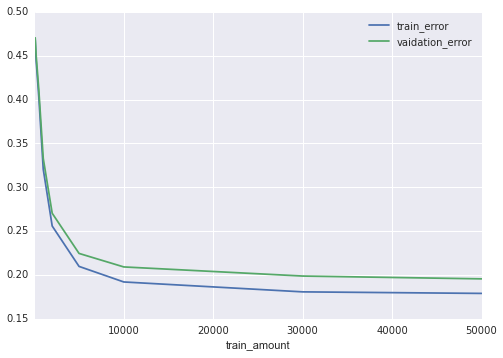


The form of the decision boundary is linear because we assume that each grouping/class/cluster has the same variance. This is because they all occupy the same fundamental amount space in our X-space, we're basically drawing linear boundaries in between each class and all the others.

### ii


```python
def get_mu_sigma2(X_, y_, labels, alpha):
    mus = []
    sigmas = []
    for label in labels:
        vals = X_[y_ == label]
        mus.append(np.mean(vals, axis=0))
        sigma = np.cov(vals.T)
        np.fill_diagonal(sigma, alpha + np.diag(sigma))
        sigmas.append(sigma)
    return mus, sigmas

def train_gaussian2(mus, sigmas, labels):
    classes = []
    for label in labels:
        model = multivariate_normal(mus[label], sigmas[label])
        classes.append((label, model))
    return classes

def run_mv2(X_, y_, test_X, test_Y, alpha):
    error_rates = []
    test_error_rates = []
    trial_amounts = [100, 200, 500, 1000, 2000, 5000, 10000, 30000, 50000]
    for x in trial_amounts:
        Xs = X_[:x]
        Ys = y_[:x]
        mus, sigmas = get_mu_sigma2(Xs, Ys, range(10), alpha)
        classes = train_gaussian2(mus, sigmas, range(10))
        print("Trained on ", len(Xs))
        error_rate = test_gaussian(classes, X_, y_)
        test_error_rate = test_gaussian(classes, test_X, test_Y)
        print('Train Error: ', error_rate,'Test Error: ', test_error_rate)
        error_rates.append(error_rate)
        test_error_rates.append(test_error_rate)
    return {"train_error":error_rates, 
            "test_error": test_error_rates, 
            "train_amount": trial_amounts}
```


```python
errors = run_mv2(dig_X_train, dig_y_train, dig_val_X, dig_val_y, 0.001)
```

    Trained on  100
    Train Error:  0.31408 Test Error:  0.3142
    Trained on  200
    Train Error:  0.21934 Test Error:  0.2219
    Trained on  500
    Train Error:  0.16576 Test Error:  0.1688
    Trained on  1000
    Train Error:  0.13348 Test Error:  0.1369
    Trained on  2000
    Train Error:  0.11266 Test Error:  0.1215
    Trained on  5000
    Train Error:  0.1085 Test Error:  0.1287
    Trained on  10000
    Train Error:  0.1 Test Error:  0.1266
    Trained on  30000
    Train Error:  0.08622 Test Error:  0.1278
    Trained on  50000
    Train Error:  0.0836 Test Error:  0.1266


```python
pd.DataFrame(errors).plot(x='train_amount')
pd.DataFrame(errors)
```


<div>
<table border="1" class="dataframe">
  <thead>
    <tr style="text-align: right;">
      <th></th>
      <th>test_error</th>
      <th>train_amount</th>
      <th>train_error</th>
    </tr>
  </thead>
  <tbody>
    <tr>
      <th>0</th>
      <td>0.3142</td>
      <td>100</td>
      <td>0.31408</td>
    </tr>
    <tr>
      <th>1</th>
      <td>0.2219</td>
      <td>200</td>
      <td>0.21934</td>
    </tr>
    <tr>
      <th>2</th>
      <td>0.1688</td>
      <td>500</td>
      <td>0.16576</td>
    </tr>
    <tr>
      <th>3</th>
      <td>0.1369</td>
      <td>1000</td>
      <td>0.13348</td>
    </tr>
    <tr>
      <th>4</th>
      <td>0.1215</td>
      <td>2000</td>
      <td>0.11266</td>
    </tr>
    <tr>
      <th>5</th>
      <td>0.1287</td>
      <td>5000</td>
      <td>0.10850</td>
    </tr>
    <tr>
      <th>6</th>
      <td>0.1266</td>
      <td>10000</td>
      <td>0.10000</td>
    </tr>
    <tr>
      <th>7</th>
      <td>0.1278</td>
      <td>30000</td>
      <td>0.08622</td>
    </tr>
    <tr>
      <th>8</th>
      <td>0.1266</td>
      <td>50000</td>
      <td>0.08360</td>
    </tr>
  </tbody>
</table>
</div>


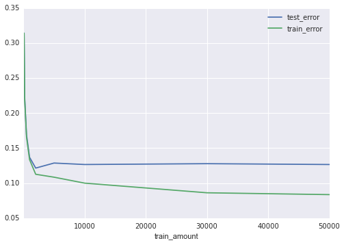


This is a non-linear decision boundary because we vary our covariance matrix with the class. This makes it non-linear because th progressions are not constant and can interweave more than they could with a constant covariance matrix.

### iii

The difference between these two is whether or not we assume they fundamentally share the same covariance matrix(i) or if they have their own individual covariance matrices(ii). When we assume that each class has its own covariance matrix we can see that some samples of our data seem to be better representations than others, for example the 500 and 1000 sets have a very small training and test error. This means that they generalize better than the 5000 sample that we pulled.

### iv


```python
dig_kaggle_X = scipy.io.loadmat("kaggle/test.mat")['test_images']/255
dig_kaggle_X.shape
```


    (10000, 784)


```python
mus, sigma = get_mu_sigma(dig_X_train, dig_y_train, range(10), 0.001)
classes = train_gaussian(mus, sigma, range(10))
y_hat = classify_gaussian(classes, dig_kaggle_X)
```


```python
yh = pd.DataFrame({"Category":y_hat, "Id":range(1,1+len(y_hat))})
yh.to_csv("out.csv",index=False)
```

Best Kaggle: 0.82160

## 7.e


```python
from scipy.stats import multivariate_normal

spam_train = scipy.io.loadmat("data/spam_data.mat")
spam_X = spam_train['training_data']
spam_y = spam_train['training_labels'].T.reshape((5172,))
print(spam_X.shape, spam_y.shape)
shuff = np.arange(len(spam_y))
np.random.shuffle(shuff)
spam_X_train = spam_X[shuff]
spam_y_train = spam_y[shuff]
train_test_amount = 3500
spam_val_X = spam_X_train[train_test_amount:]
spam_val_y = spam_y_train[train_test_amount:]
spam_X_train = spam_X_train[:train_test_amount]
spam_y_train = spam_y_train[:train_test_amount]

spam_X_test = spam_train['test_data']

print(spam_X_train.shape,spam_y_train.shape, spam_val_X.shape) # make sure our shapes are good
```

    (5172, 32) (5172,)
    (3500, 32) (3500,) (1672, 32)


```python
def run_mv_spam(X_, y_, test_X, test_Y, alpha):
    error_rates = []
    test_error_rates = []
    trial_amounts = [100, 200, 500, 1000, 2000, 4000]
    for x in trial_amounts:
        Xs = X_[:x]
        Ys = y_[:x]
        mus, sigma = get_mu_sigma(Xs, Ys, range(2), alpha)
        classes = train_gaussian(mus, sigma, range(2))
        print("Trained on ", len(Xs))
        error_rate = test_gaussian(classes, X_, y_)
        test_error_rate = test_gaussian(classes, test_X, test_Y)
        print(error_rate,test_error_rate)
        error_rates.append(error_rate)
        test_error_rates.append(test_error_rate)
    return {"train_error":error_rates, 
            "vaidation_error": test_error_rates, 
            "train_amount": trial_amounts}

def run_mv2_spam(X_, y_, test_X, test_Y, alpha):
    error_rates = []
    test_error_rates = []
    trial_amounts = [100, 200, 500, 1000, 2000, 4000]
    for x in trial_amounts:
        Xs = X_[:x]
        Ys = y_[:x]
        mus, sigmas = get_mu_sigma2(Xs, Ys, range(2), alpha)
        classes = train_gaussian2(mus, sigmas, range(2))
        print("Trained on ", len(Xs))
        error_rate = test_gaussian(classes, X_, y_)
        test_error_rate = test_gaussian(classes, test_X, test_Y)
        print('Train Error: ', error_rate,'Test Error: ', test_error_rate)
        error_rates.append(error_rate)
        test_error_rates.append(test_error_rate)
    return {"train_error":error_rates, 
            "test_error": test_error_rates, 
            "train_amount": trial_amounts}
```


```python
errors = run_mv_spam(spam_X_train, spam_y_train, spam_val_X, spam_val_y, 0.001)
pd.DataFrame(errors).plot(x='train_amount')
pd.DataFrame(errors)
```

    Trained on  100
    0.241142857143 0.230861244019
    Trained on  200
    0.234857142857 0.213516746411
    Trained on  500
    0.204571428571 0.196172248804
    Trained on  1000
    0.193142857143 0.197966507177
    Trained on  2000
    0.194571428571 0.198564593301
    Trained on  3500
    0.192285714286 0.196770334928


<div>
<table border="1" class="dataframe">
  <thead>
    <tr style="text-align: right;">
      <th></th>
      <th>train_amount</th>
      <th>train_error</th>
      <th>vaidation_error</th>
    </tr>
  </thead>
  <tbody>
    <tr>
      <th>0</th>
      <td>100</td>
      <td>0.241143</td>
      <td>0.230861</td>
    </tr>
    <tr>
      <th>1</th>
      <td>200</td>
      <td>0.234857</td>
      <td>0.213517</td>
    </tr>
    <tr>
      <th>2</th>
      <td>500</td>
      <td>0.204571</td>
      <td>0.196172</td>
    </tr>
    <tr>
      <th>3</th>
      <td>1000</td>
      <td>0.193143</td>
      <td>0.197967</td>
    </tr>
    <tr>
      <th>4</th>
      <td>2000</td>
      <td>0.194571</td>
      <td>0.198565</td>
    </tr>
    <tr>
      <th>5</th>
      <td>4000</td>
      <td>0.192286</td>
      <td>0.196770</td>
    </tr>
  </tbody>
</table>
</div>


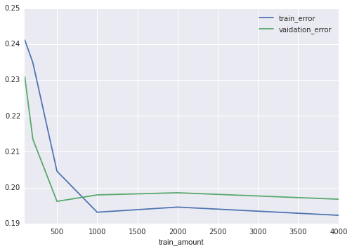


```python
errors = run_mv2_spam(spam_X_train, spam_y_train, spam_val_X, spam_val_y, 0.001)
pd.DataFrame(errors).plot(x='train_amount')
pd.DataFrame(errors)
```

    Trained on  100
    Train Error:  0.278857142857 Test Error:  0.308612440191
    Trained on  200
    Train Error:  0.340857142857 Test Error:  0.364234449761
    Trained on  500
    Train Error:  0.353142857143 Test Error:  0.393540669856
    Trained on  1000
    Train Error:  0.348285714286 Test Error:  0.38456937799
    Trained on  2000
    Train Error:  0.207142857143 Test Error:  0.202751196172
    Trained on  3500
    Train Error:  0.206571428571 Test Error:  0.203947368421


<div>
<table border="1" class="dataframe">
  <thead>
    <tr style="text-align: right;">
      <th></th>
      <th>test_error</th>
      <th>train_amount</th>
      <th>train_error</th>
    </tr>
  </thead>
  <tbody>
    <tr>
      <th>0</th>
      <td>0.308612</td>
      <td>100</td>
      <td>0.278857</td>
    </tr>
    <tr>
      <th>1</th>
      <td>0.364234</td>
      <td>200</td>
      <td>0.340857</td>
    </tr>
    <tr>
      <th>2</th>
      <td>0.393541</td>
      <td>500</td>
      <td>0.353143</td>
    </tr>
    <tr>
      <th>3</th>
      <td>0.384569</td>
      <td>1000</td>
      <td>0.348286</td>
    </tr>
    <tr>
      <th>4</th>
      <td>0.202751</td>
      <td>2000</td>
      <td>0.207143</td>
    </tr>
    <tr>
      <th>5</th>
      <td>0.203947</td>
      <td>4000</td>
      <td>0.206571</td>
    </tr>
  </tbody>
</table>
</div>


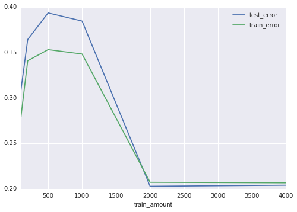


```python
mus, sigma = get_mu_sigma2(spam_X_train, spam_y_train, range(2), 0.001)
classes = train_gaussian2(mus, sigma, range(2))
y_hat = classify_gaussian(classes, spam_X_test)
```


```python
yh = pd.DataFrame({"Category":y_hat, "Id":range(1,1+len(y_hat))})
yh.to_csv("out_spam2.csv",index=False)
```

Best Kaggle: 0.74660
